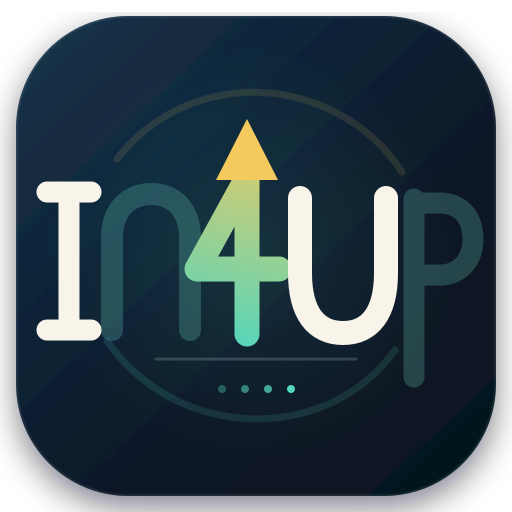

<p align="center">
  
</p>

<h1 align="center">VipSound</h1>

<p align="center">
  <strong>Advanced Audio Player &amp; Language-Learning Ecosystem</strong>
</p>

<p align="center">
  <a href="https://github.com/Pabhassaracitto/vipsound/releases"></a>
  <a href="https://github.com/Pabhassaracitto/vipsound/blob/main/LICENSE"></a>
  <a href="https://flutter.dev"></a>
  <a href="https://github.com/Pabhassaracitto/vipsound/actions"></a>
  
</p>

---

VipSound is a cross-platform multimedia application built with **Flutter**, optimized for
intensive language learning, Dharma listening, and high-fidelity audio playback.

At its core is the **UltraTimeStretch Engine V2** — a native C++ DSP backend accessed via
Dart FFI — which delivers extreme time-stretching with natural voice quality.

> 🔗 Repository: [github.com/Pabhassaracitto/vipsound](https://github.com/Pabhassaracitto/vipsound)

## Table of Contents

- [Core Technology](#core-technology)
- [Key Features](#key-features)
- [Architecture](#architecture)
- [Getting Started](#getting-started)
- [Platform Support](#platform-support)
- [Roadmap](#roadmap)
- [Contributing](#contributing)
- [License](#license)
- [Tiếng Việt](#tiếng-việt)

## Core Technology

VipSound is built around a custom native audio engine designed for language learners who
need to slow down or speed up speech without losing intelligibility.

- **UltraTimeStretch Engine V2** — a native C++ DSP core invoked through Dart FFI for
  extreme, artifact-free time-stretching.
- **Wide speed range** — playback from **0.05× to 10.0×** while preserving voice clarity.
- **Multi-Resolution Phase Vocoder** combined with **Harmonic–Percussive Separation** to
  minimize artifacts at ultra-slow speeds.
- **Formant preservation** via cepstral analysis to avoid the "chipmunk effect" when
  changing speed or pitch.
- **SIMD optimization** (NEON / AVX) for low-latency processing on Android, iOS, and Windows.

## Key Features

### 1. Adaptive Learning Modes

| Mode | Description |
| ---- | ----------- |
| **LISTEN** | Modern rolling-waveform UI with a fixed playhead, A–B looping, and a configurable gap between loops for better internalization. |
| **READ** | Interactive text reader with CEFR-based highlighting (A1–C2) and part-of-speech tagging (Noun, Verb, …), plus multi-engine translation (Google, DeepLX, Libre, Zalo AI). |
| **UNDERSTAND** | Audio–text synchronization (LRC / SRT) with a Shadowing Mode that records the user's speech and scores pronunciation at the phoneme level. |
| **MEMORY — "Memory Garden"** | Vocabulary SRS powered by the SM-2 (Anki-style) algorithm, visualized through growth stages: Seed → Sprout → Tree → Branch → Bud → Bloom. |

### 2. Rich Content Sources

- **YouTube Explorer** — search, download audio, and fetch multi-language captions to turn
  videos into learning materials.
- **Cloud & Local Library** — stream or play audio from Google Drive or local storage.
- **Integrated Readers** — a built-in PDF Reader and Web Reader that extract text for
  instant analysis and "Text Studio" processing.

### 3. Smart Sync & Offline-First

- **Cross-device sync** using Firebase Auth and Cloud Firestore for vocabulary and learning
  progress.
- **Offline-first design** with local storage in Hive for instant access without a network
  connection.

## Architecture

### Tech Stack

- **Framework:** Flutter (Dart)
- **Native Engine:** C++ UltraTimeStretch core via Dart FFI
- **Backend & Sync:** Firebase Auth, Cloud Firestore, Hive (local DB)
- **Platforms:** Android, iOS, Windows, Web (native libraries built with CMake)

### `lib/` Structure

| Path | Responsibility |
| ---- | -------------- |
| `audio/` | Core playback services and UltraTimeStretch bindings |
| `features/` | PDF / Web readers, YouTube downloader, TTS, translation, etc. |
| `models/` | Data models for vocabulary, segments, playback state, etc. |
| `providers/` | State management for player, text analysis, and memory algorithms |
| `screens/` | UI screens for the different learning modes and tools |
| `ffi/` | Dart FFI bindings to the native C++ audio processor |
| `services/` | Cross-cutting services (storage, sync, network) |
| `widgets/` | Reusable UI components |

## Getting Started

### Prerequisites

- **Flutter SDK** 3.0.0 or newer
- A **Firebase project** (`google-services.json` for Android, `GoogleService-Info.plist` for iOS)
- A **C++ toolchain and CMake** for building the native engine, especially on Windows

### Clone & Install

```bash
git clone https://github.com/Pabhassaracitto/vipsound.git
cd vipsound

# Install Dart / Flutter dependencies
flutter pub get
```

### Configure Firebase

- **Android:** place `google-services.json` under `android/app/` from your Firebase Console project.
- **iOS:** place `GoogleService-Info.plist` under `ios/Runner/` and configure the Xcode project as usual.

### Run

```bash
# Android / iOS
flutter run

# Windows (ensure native libs are built via CMake)
flutter run -d windows

# Web
flutter run -d web
```

> ⚠️ **Note:** This project is intended for personal educational use. Please respect
> copyright when downloading external content (e.g. YouTube).

## Platform Support

| Platform | Status | Notes |
| -------- | ------ | ----- |
| Android | ✅ Supported | UltraTimeStretch built as a native library, accessed via FFI |
| iOS | ✅ Supported | Native library via FFI; build with `--no-codesign` for sideload |
| Windows | ✅ Supported | Requires a CMake build; see `windows/` and `native/` |
| Web | ✅ Supported | Runs in the browser |

## Roadmap

- Richer Shadowing feedback with deeper pronunciation analytics.
- Additional TTS / translation engines and improved offline support.
- UI/UX refinements for the waveform editor and Memory Garden.

## Contributing

Contributions are welcome for personal, educational, and non-commercial purposes. Please
open an issue to discuss substantial changes before submitting a pull request.

## License

This project is released under the **VipSound Source-Available License (Non-Commercial)**.

You may use, copy, and modify the source code for personal, educational, and
non-commercial research purposes. Commercial use of VipSound, in whole or in part,
requires prior written permission from the author.

See the [LICENSE](./LICENSE) file for the full terms.

---

## Tiếng Việt

### Giới thiệu

VipSound là ứng dụng nghe nhạc và học tập đa nền tảng, tối ưu cho nghe Pháp thoại, luyện
nghe tiếng Anh và thưởng thức âm nhạc chất lượng cao. Ứng dụng sử dụng bộ xử lý âm thanh
**UltraTimeStretch V2** (C++ native + Dart FFI) cho phép thay đổi tốc độ cực rộng mà vẫn
giữ giọng nói tự nhiên.

### Công nghệ cốt lõi

- Tốc độ phát từ **0.05× đến 10.0×**.
- Phase Vocoder đa phân giải, tách Harmonic–Percussive, bảo toàn Formant để tránh biến dạng
  giọng nói.
- Tối ưu SIMD (NEON / AVX) cho Android, iOS, Windows.

### Hệ sinh thái học tập

- **Chế độ NGHE:** Giao diện waveform rolling, lặp A–B, khoảng lặng tùy chỉnh.
- **Chế độ ĐỌC:** Highlight theo CEFR, loại từ, tra từ và dịch thuật đa nguồn.
- **Chế độ HIỂU:** Đồng bộ âm thanh – phụ đề, Shadowing và chấm điểm phát âm theo âm vị.
- **Vườn Trí Nhớ:** Ôn tập từ vựng với thuật toán SM-2, mô phỏng quá trình "cây" phát triển.

### Nguồn nội dung

- **YouTube Explorer:** Tìm kiếm, tải audio và captions từ YouTube.
- **Trình đọc PDF & Web:** Trích xuất văn bản để đọc và phân tích.
- **Cloud Storage:** Kết nối Google Drive để stream / tải file cá nhân.

### Cài đặt nhanh

```bash
git clone https://github.com/Pabhassaracitto/vipsound.git
cd vipsound
flutter pub get
flutter run
```

> 🔧 **Lưu ý:** Cần cấu hình Firebase (`google-services.json` / `GoogleService-Info.plist`)
> và build thư viện native bằng CMake trên Windows.
