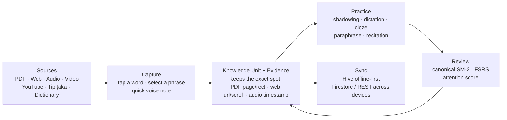
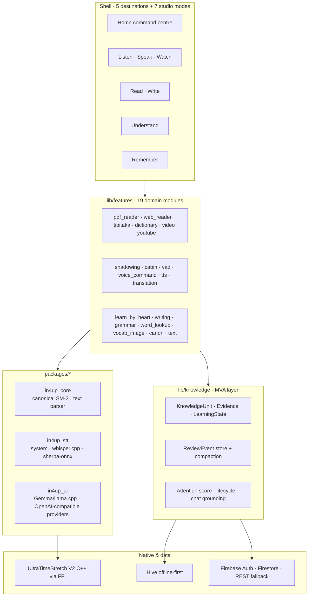

<div align="center">


# In4Up

### Listen · Speak · Watch · Read · Write · Understand · Remember

**An offline-first study studio for deep listening and language learning**, built on the
**UltraTimeStretch V2** native audio engine — playback from **0.05× to 10×** with a voice that still sounds human.

[](https://github.com/Pabhassaracitto/In4Up/releases)
[](pubspec.yaml)
[](https://flutter.dev)
[](#platform-support)
[](#status-at-a-glance)
[](https://github.com/Pabhassaracitto/In4Up/actions/workflows/app_analyze.yml)
[](LICENSE)

**English** · [🇻🇳 Tiếng Việt](README.vi.md)

</div>

---

## In 30 seconds

Most learning apps make you switch tools: one to slow audio down, one to read the PDF, one to translate,
one to drill flashcards. Every switch costs attention, and attention is the scarce resource in deep study.

**In4Up puts the whole loop in one place, on one device, mostly offline:**

| | |
|---|---|
| 🎧 **Hear every syllable** | Native C++ time-stretch, 0.05×–10×, formant-preserving — a 0.3× Dhamma talk or English lecture stays intelligible. |
| 📖 **Decode what you hear** | Read mode with IPA layers, CEFR/part-of-speech colouring, multi-engine translation, PDF/Web/Tipiṭaka readers. |
| 🎙️ **Produce it yourself** | Shadowing with phoneme scoring, live STT cabin, dictation, cloze, paraphrase & summary studio. |
| 🌱 **Keep it** | One canonical SM-2 engine + FSRS for recitation, Memory Garden, attention scoring, cross-device sync. |
| 🔒 **Stay private** | Whisper, Sherpa-ONNX, Piper and llama.cpp run **on device**; cloud AI is opt-in, BYOK, never bundled with keys. |

---

## Contents

- [Status at a glance](#status-at-a-glance)
- [The Studio: seven modes](#the-studio-seven-modes)
- [The learning loop](#the-learning-loop)
- [What shipped recently](#what-shipped-recently)
- [Feature catalogue](#feature-catalogue)
- [On-device AI & the model centre](#on-device-ai--the-model-centre)
- [Architecture](#architecture)
- [Design system](#design-system)
- [Getting started](#getting-started)
- [Platform support](#platform-support)
- [Quality gates](#quality-gates)
- [Roadmap](#roadmap)
- [How this project is run](#how-this-project-is-run)
- [License & credits](#license--credits)

---

## Status at a glance

> Single source of truth for work status is [`docs/project/KANBAN.md`](docs/project/KANBAN.md).
> The numbers below are a snapshot of that board on **2026-09-28**.

| Signal | Value |
|---|---|
| Work items on the board | **88** — ✅ 60 done · 🔄 19 in flight · 📋 6 proposed · 🚫 3 blocked |
| Delivery milestones | **M0 · M1 · M2 done** (knowledge schema → memory pipeline → suggestion intelligence); M3 is deliberately out of scope |
| Architecture decisions | **ADR-0001 → ADR-0008** recorded in [`docs/adr/`](docs/adr) |
| Accepted plans | **32** entries in [`docs/project/PLAN.md`](docs/project/PLAN.md) |
| Code size | ~**600** Dart files · ~**255k** lines across `lib/` + `packages/` |
| Automated tests | **81** test files (knowledge, PDF reader, IPA, translation, LHB, cabin, locale gate…) |
| UI locales | **26** ARB catalogues · **492** keys each |
| CI oracles | `app_analyze.yml` (analyze + rule #5 locale + LHB + cabin), `build.yml`, `build_final_complete.yml` |
| Known blockers | Windows release zip packaging, Linux CI (`webkit2gtk-4.1`), both waiting on repo-owner actions |

**Legend used throughout this document:** ✅ shipped & CI green · 🔄 in progress · 📋 planned · 🚫 blocked.
"Shipped" means the code is on the development trunk with green CI; several items additionally await
on-device acceptance by the owner, which the Kanban card records per item.

---

## The Studio: seven modes

The shell keeps **five destinations** in the bottom bar so navigation stays inside working memory
(Home · Listen · Read · Understand · Remember). Inside Listen and Read, a secondary switch reveals the
sibling modes, and Home surfaces all seven as the **Studio Room** grid.

| Mode | Where | What you actually do |
|---|---|---|
| 🎧 **NGHE / Listen** | Listen tab | Rolling waveform with a fixed playhead, A–B loops with configurable silence gaps, LRC/subtitle curtain, Soundlist index, speed 0.05×–10×. |
| 🎙️ **NÓI / Speak** | Listen ▸ sub-mode | Shadowing hub: record, align, phoneme-level pronunciation scoring, presets (built-in + personal), speaking history with exportable feedback. |
| 📺 **XEM / Watch** | Listen ▸ sub-mode | Local video library and player with subtitles, word capture from what you watch. |
| 📖 **ĐỌC / Read** | Read tab | Interactive reader: IPA layers, CEFR + part-of-speech colouring, tap-to-save vocabulary with context, batch selection save, PDF / Web / Tipiṭaka / dictionary integration. |
| ✍️ **VIẾT / Write** | Read ▸ sub-mode | Write Studio: copy, cloze, multiple choice, "rewrite the idea", "short summary" — local heuristic scoring first, optional local-AI second tier. |
| 💡 **HIỂU / Understand** | Understand tab | Audio↔text synchronisation, bilingual playback, comprehension checks, translation across tabs. |
| 🌱 **NHỚ / Remember** | Remember tab | Memory Garden (Seed → Sprout → Tree → Branch → Bud → Bloom), SM-2 review queues, word lists, timeline, stats, knowledge map, Learn-by-Heart. |

Tools are **not** a sixth tab. They live in a context-aware **quick-actions overlay** (⚡) whose ordering
adapts to the current tab and recent usage — Cabin, YouTube, PDF, Web Reader, YouGlish, Soundlist,
Dictionary, Video library, Word list, Review, Stats, Word map, Tipiṭaka, and more.

---

## The learning loop


```mermaid
flowchart LR
  A["Sources<br/>PDF · Web · Audio · Video<br/>YouTube · Tipiṭaka · Dictionary"] --> B["Capture<br/>tap a word · select a phrase<br/>quick voice note"]
  B --> C["Knowledge Unit + Evidence<br/>keeps the exact spot:<br/>PDF page/rect · web url/scroll · audio timestamp"]
  C --> D["Practice<br/>shadowing · dictation · cloze<br/>paraphrase · recitation"]
  D --> E["Review<br/>canonical SM-2 · FSRS<br/>attention score"]
  E --> C
  C --> F["Sync<br/>Hive offline-first<br/>Firestore / REST across devices"]
```

Two product rules protect this loop and are enforced in code review:

1. **Reopening the source must never break.** Evidence stores the coordinates that let you jump back to
   the precise page rectangle, scroll offset, or timestamp (ADR-0003).
2. **Reading is never interrupted by a modal.** The Dual-Memory lifecycle
   (Observed → Captured → Promoted → Practicing → Maintained) promotes items in the background;
   five minutes of reading must produce zero blocking dialogs.

---

## What shipped recently

Highlights from the current development cycle. Each line maps to a Kanban card ID you can search in
[`docs/project/KANBAN.md`](docs/project/KANBAN.md).

<details open>
<summary><b>🔊 Sound, speech & the offline speech stack</b></summary>

- ✅ **Soundlist / Âm mục** — turn any recording into a navigable talking book: sound marks, book-style
  table of contents, saved A–B segments, **auto-TOC** (Silero VAD splits by silence, Whisper titles each
  chapter), searchable transcripts, and "you looped this 3× in 14 days" smart suggestions.
- ✅ **Sherpa-ONNX stack** — Silero VAD replaces the energy-based fallback (`SHERPA-001`), **Piper neural TTS**
  offline (`SHERPA-002`), 30-minute VAD chunking pipeline (`SHERPA-003`), speaker waveform + **voice commands**
  (`SHERPA-WP23-01`), and **Zipformer live STT** — Vietnamese offline + English streaming (`SHERPA-WP4-01`).
- ✅ **Whisper hardening** — serialized native requests and pre-flight checks killed the `libwhisper.so`
  SIGSEGV crash (`STT-CRASH-001`); LRC generation now offers 14 languages plus `auto` detection (`STT-LRC-LANG-01`).
- ✅ **Cabin (live interpretation booth)** — self-healing microphone sessions, no 2-minute cap, dictation mode,
  and 🔨 **Cabin Save**: WAV recording + bilingual LRC saved as a session you can reopen in the Read tab.
- ✅ **Audio library** — Android MediaStore/SAF scanning, `content://` playback fixes, persistent audio imports.

</details>

<details open>
<summary><b>📖 Reading, IPA & text intelligence</b></summary>

- ✅ **IPA suite (READ-IPA-001 → 004)** — three-state IPA toggle with a phonetic line under the text,
  provenance-aware resolution (**MDX dictionary → CMUdict → grapheme-to-phoneme fallback**), ruby-style
  word chips that pulse with TTS playback, and phoneme colouring derived from the colour-blind-safe
  **Okabe-Ito** palette, with mastered words fading out.
- 🔄 **READ-IPA-006** — interactive IPA colour panel (hide categories individually), liaison colouring and
  stressed-word marking; code complete, awaiting CI + device acceptance.
- ✅ **Save what you read, properly** — multi-line phrase/sentence capture with topic + language, an edit
  sheet that never loses fields, an optional "already saved" marker with a legend, and smart batch save
  shared by the PDF and Web readers.
- 🔨 **PDF reader waves 0–2** — selection bridge, sentence TTS, stable file identity (`md5(size|mtime)`),
  a documented coordinate system (ADR-0003/0004), outline, in-file search, thumbnails, page jump, keyboard
  shortcuts, reading themes, annotation export/import (JSON / XFDF / stamped PDF). 134 tests written.
- 🔄 **Dictionary MDX/MDD** (`DICT-001`) — import, look up and manage multilingual dictionaries on device.
- ✅ **Tipiṭaka module** — normalised SQLite reader with bilingual view, search, 26 language packs and an
  import script; see [`docs/tipitaka_database.md`](docs/tipitaka_database.md).
- 📋 **READ-GRAM-001** — phrase and sentence-structure analysis next to "part of speech / CEFR".
  A truthful spike measured 17/25 frozen cases (68 %); the plan and root-cause analysis live in
  PLAN-031 + ADR-0007 before any code is written.

</details>

<details open>
<summary><b>🧠 Knowledge, memory & AI</b></summary>

- ✅ **Knowledge MVA layer** (`lib/knowledge/`, MVA-T1 → T8) — KnowledgeUnit · Evidence · LearningState ·
  ReviewEvent · LearningAction, undoable merge/split, append-only review log with compaction,
  Dual-Memory lifecycle, **Attention Score v1**, and **chat grounding with a citation validator**.
- ✅ **One canonical SM-2** (ADR-0001) — the fourth dead copy of the algorithm was deleted and a 384-case
  equivalence grid protects the semantics. Listen / Read / Understand keep **separate** skill scores by design.
- ✅ **Learn by Heart (Thuộc lòng)** — FSRS cold start, four-tier vanishing cloze, first-letter mnemonics,
  **voice recall** with fuzzy alignment, chained recitation, Anki `{{c1::}}` cloze, and multi-device sync
  with tombstones + pending queue (ADR-0006, 47 tests in CI).
- ✅ **Real local AI chat** — llama.cpp / Gemma GGUF backend with a FIFO queue, bounded context budget,
  finite timeouts, isolate self-recovery, and an eight-branch status banner. CI builds the native backend
  on Android, iOS and Windows.
- ✅ **Server API layer WP0** (`API-001`, ADR-0008) — one OpenAI-compatible client for **Ollama, LM Studio,
  llama-server, Groq, Gemini-compat, OpenRouter, OpenAI**; provider CRUD with connection test and dynamic
  model list; per-capability routing (`offlineFirst` default · `onlineFirst` · `offlineOnly`); **BYOK** —
  the app ships no keys, and with nothing configured **no request ever leaves the device**.
- ✅ **Translation** — Buddhist/Pāli glossary with protected tokens applied before every engine,
  ML Kit offline pairs (EN↔VI, EN↔HI, HI↔VI pivoted through EN), plus an online-first smart default that
  silently falls back offline. Engines: Google (free) · DeepLX · Libre · MyMemory · ML Kit · Hy-MT · offline.

</details>

<details open>
<summary><b>🏠 Shell, Home & platform</b></summary>

- ✅ **Home as command centre** — Studio Room with all seven modes, real learning-event streak
  (`HOME-STREAK-001`), knowledge-graph preview, and **quick capture**: one microphone flow that prefers
  offline Sherpa and falls back to the system recogniser, writing straight into your word list.
- ✅ **Navigation restructure** — five destinations, quick-actions overlay instead of a Tools tab,
  compact/auto-hide mode switch, long-press to cycle sub-modes, per-tab memory of the last sub-mode.
- ✅ **Responsive system** — clamped text scale, `ResponsiveContentFrame`, adaptive grid columns and fixed
  card extents so accessibility font sizes cannot overflow the layout.
- ✅ **Internationalisation governance** (ADR-0002) — tiered rollout vi → en → {hi, zh, zh_TW, si} → rest,
  with a CI ratchet: coverage can only go up, and a machine test fails the build if any non-Vietnamese
  locale still shows Vietnamese chrome.
- ✅ **Linux sign-in** (ADR-0005) — Google login and vocabulary sync through Firebase REST where the native
  FlutterFire plugins do not exist, with zero new dependencies.
- 🔄 **YouTube learning** in the style of Language Reactor, local-first with no yt-dlp server.

</details>

---

## Feature catalogue

<details>
<summary><b>Audio engine — UltraTimeStretch V2</b></summary>

- Native C++ DSP reached through Dart FFI (`lib/ffi/`, sources in `native/`).
- Speed **0.05× – 10×**, pitch shifting in semitones, formant preservation via cepstral analysis so voices
  never turn into chipmunks.
- Multi-resolution phase vocoder plus harmonic/percussive separation to suppress artefacts at extreme slowdown.
- SIMD paths (NEON / AVX) for low latency on mobile and desktop.
- ⚠️ **Protected area.** Golden rule #1: `lib/ffi/` and the UltraTimeStretch C++ core are not modified without
  the owner's explicit approval — real-time audio regressions are expensive and hard to detect in CI.

</details>

<details>
<summary><b>Content sources</b></summary>

| Source | Capability |
|---|---|
| Local audio | MediaStore / SAF scanning, persistent imports, waveform cache, fingerprint-based identity |
| Local video | Library + player with subtitles, capture words while watching |
| PDF | Render + text extraction (pdfrx/PDFium), annotations, outline, search, export |
| Web | In-app reader with extraction candidates, batch capture, word tap sheet |
| YouTube | Search, audio download, multi-language captions → study material |
| Google Drive | Browse and stream personal audio |
| Tipiṭaka | Normalised SQLite canon, bilingual reader, search, downloadable language packs |
| Dictionaries | MDX/MDD import, offline lookup, IPA source for saved words |
| Text files | `.txt`, `.md`, `.json`, `.docx`, LRC/SRT — pure-Dart loaders, no extra dependencies |

</details>

<details>
<summary><b>Speech in and out</b></summary>

- **STT (`packages/in4up_stt`)** — hybrid facade over the system recogniser, **whisper.cpp** (FFI on Windows,
  plugin on mobile) and **sherpa-onnx Zipformer** (offline Vietnamese, streaming English), with a model
  manager, audio conversion (FFmpegKit on mobile, `ffmpeg` process on desktop), LRC conversion, and
  speaker diarization sidecars.
- **TTS** — Google, FPT, Zalo, the OS engine, and **Piper neural voices** offline, with caching, language
  detection, per-voice preferences and a download catalogue sourced from `rhasspy/piper-voices`.
- **Pronunciation** — CMUdict + rule-based G2P, phoneme analyser, waveform comparison, score cards.

</details>

<details>
<summary><b>Sync, storage & privacy</b></summary>

- Offline-first **Hive** storage for everything the learner creates; the network is an enhancement, never a gate.
- **Firebase Auth** (Google / anonymous) + **Cloud Firestore** for vocabulary, Learn-by-Heart items, SRS state
  and streaks; a pending-operation queue survives offline periods, with last-writer-wins merge plus tombstones.
- **Firestore REST fallback** on platforms without native plugins (Linux).
- Cloud AI is strictly opt-in and BYOK; cleartext HTTP is only permitted for LAN addresses.

</details>

---

## On-device AI & the model centre

Nothing large is bundled into the app binary. Open **Home ▸ AI Model Manager** to import a file you already
have or download on demand — the app never downloads a model on its own. The current end-user walkthrough
(Vietnamese) is [`docs/USER_GUIDE.vi.md`](docs/USER_GUIDE.vi.md); developer model layouts are documented in
[`docs/project/MODELS.md`](docs/project/MODELS.md).

| Model | Folder under `documents/` | Size | Used for | Needed? |
|---|---|---|---|---|
| **Whisper** (ggml) | `in4up_whisper_models/` | 37–75 MB | transcription, LRC, auto-TOC titles | for STT |
| **Silero VAD** (onnx) | `sherpa_vad_models/` | 2–5 MB | silence splitting, fast long-file processing | recommended |
| **Piper TTS** | `sherpa_piper_models/` | ~75 MB / voice | neural offline speech | for offline TTS |
| **Zipformer ASR** | `sherpa_asr_models/` | 20–32 MB | live offline speech recognition | for the Cabin |
| **Gemma / llama.cpp GGUF** | model centre | 0.6–2 GB | local chat, analysis, writing feedback | optional |
| **Hy-MT GGUF** | model centre | ~600 MB | offline machine translation | optional |

> The **Server API layer** exists precisely because heavy models cost RAM, heat and load time on phones:
> point In4Up at Ollama or LM Studio on your PC over the LAN, or at a cloud endpoint with your own key,
> and keep the offline path as the default fallback.

---

## Architecture


```mermaid
flowchart TB
  subgraph Shell["Shell · 5 destinations + 7 studio modes"]
    Home["Home command centre"]
    Listen["Listen · Speak · Watch"]
    Read["Read · Write"]
    Understand["Understand"]
    Remember["Remember"]
  end

  subgraph Features["lib/features · 19 domain modules"]
    F1["pdf_reader · web_reader · tipitaka · dictionary · video · youtube"]
    F2["shadowing · cabin · vad · voice_command · tts · translation"]
    F3["learn_by_heart · writing · grammar · word_lookup · vocab_image · canon · text"]
  end

  subgraph Knowledge["lib/knowledge · MVA layer"]
    K1["KnowledgeUnit · Evidence · LearningState"]
    K2["ReviewEvent store + compaction"]
    K3["Attention score · lifecycle · chat grounding"]
  end

  subgraph Packages["packages/*"]
    P1["in4up_core<br/>canonical SM-2 · text parser"]
    P2["in4up_stt<br/>system · whisper.cpp · sherpa-onnx"]
    P3["in4up_ai<br/>Gemma/llama.cpp · OpenAI-compatible providers"]
  end

  subgraph Native["Native & data"]
    N1["UltraTimeStretch V2 C++ via FFI"]
    N2["Hive offline-first"]
    N3["Firebase Auth · Firestore · REST fallback"]
  end

  Shell --> Features --> Knowledge
  Features --> Packages
  Knowledge --> N2
  Packages --> N1
  Knowledge --> N3
```

### Repository map

| Path | What lives there |
|---|---|
| `lib/screens/` | Shell, five tabs, Studio modes, tools, settings (142 files) |
| `lib/features/` | 19 self-contained domain modules (221 files) |
| `lib/knowledge/` | Knowledge MVA models, review store, attention, grounding (18 files) |
| `lib/services/` | Storage, sync, IPA resolution, audio library, auto-TOC, text loaders (28 files) |
| `lib/providers/` | Player, text, vocabulary, waveform, focus state (15 files) |
| `lib/core/` | Language catalogue (26 locales) and the responsive system |
| `lib/l10n/` | 26 ARB catalogues × 492 keys + generated localisations |
| `lib/ffi/`, `lib/native/`, `native/` | UltraTimeStretch bindings and C++ sources (**protected**) |
| `packages/` | `in4up_core`, `in4up_stt`, `in4up_ai` |
| `android/ ios/ windows/ linux/ web/` | Platform shells, native CMake, flavors |
| `assets/` | Icons, CMUdict, glossary, Tipiṭaka demo DB, model drop-folders |
| `brand/` | Logo concepts, chosen mark, colour tokens |
| `docs/` | Governance, Kanban, plans, ADRs, agent skills, handovers |
| `test/`, `tool/`, `scripts/` | 81 test files, i18n tooling, CI helpers, importers |

---

## Design system

The interface is built for long, low-light study sessions: a dark canvas, one warm accent for meaning,
one cool accent for growth, and colour used as **information**, never decoration.

### Brand tokens

| Swatch | Token | Hex | Role & intent |
|---|---|---|---|
|  | Midnight | `#06121E` | App canvas. Low luminance reduces eye fatigue and keeps the waveform the brightest object on screen. |
|  | Deep knowledge | `#091A2A` | Cards and sheets — a single step of elevation, so depth is felt rather than announced. |
|  | Bodhi gold | `#F4C95D` | Insight, wisdom, the upward stroke of the mark. Reserved for the one action that matters most on a screen. |
|  | Growth jade | `#53D6BD` | Progress, streaks, success. Paired with gold it reads as "calm growth" rather than "gamified win". |
|  | Warm ivory | `#F8F4EA` | Body text. Softer than pure white, which lowers halation on dark backgrounds during long reading. |

### Mode colours

Each studio mode owns one hue, and the same hue follows you into the app bar, the mode chip and the card —
so you always know where you are without reading a label.

|  Listen `#6C63FF` |  Speak `#B388FF` |  Watch `#FFB300` |  Read `#2196F3` |
|---|---|---|---|
|  **Write** `#26C6DA` |  **Understand** `#FFB300` |  **Remember** `#4CAF50` | |

Phoneme colouring in Read mode uses the **Okabe-Ito** colour-blind-safe palette, and every colour cue has a
non-colour partner (icon, label, or legend) so no information is lost to colour vision deficiency.

### Layout rules

- **Five destinations maximum** in the bottom bar; secondary modes are revealed, not stacked.
- Breakpoints `compact · medium · expanded · large`, with `ResponsiveContentFrame` capping line length on
  desktop and `adaptiveGridColumns` choosing 1–5 columns for the Studio grid.
- Card heights are fixed by `mainAxisExtent` instead of aspect ratio, so large system fonts cannot cause
  `RenderFlex` overflow.
- System text scale is clamped app-wide in `MaterialApp.builder`.
- Touch targets stay at or above 44 × 32 dp; contextual menus anchor to the chip, not the list.
- Headers and banners auto-hide after a few seconds; the mode switch can be compact, auto-hiding, or replaced
  by a long-press on the tab.
- Manual QA scenarios are written down in [`docs/shell_manual_qa_checklist.md`](docs/shell_manual_qa_checklist.md).

---

## Getting started

### Prerequisites

- **Flutter 3.44.1** (the version pinned in CI) with Dart SDK `>=3.0.0 <4.0.0`
- Android: JDK 17, Android SDK 35, NDK `28.2.13676358`, CMake toolchain
- iOS: Xcode with deployment target **15.5+**
- Windows: Visual Studio C++ toolchain + CMake (needed for the native engines)
- Optional: a Firebase project — without it the app still runs, sync is simply disabled

### Clone & run

```bash
git clone https://github.com/Pabhassaracitto/In4Up.git
cd In4Up
flutter pub get

# Android — flavors: stable | dev | beta  (com.in4up[.dev|.beta])
flutter run --flavor stable

# Desktop
flutter run -d windows
flutter run -d linux

# iOS
flutter run -d ios
```

### Firebase (optional but recommended)

| Platform | File | Location |
|---|---|---|
| Android | `google-services.json` | `android/app/` — one file covers all three flavors |
| iOS / macOS | `GoogleService-Info.plist` | `ios/Runner/` |
| Other | generated options | `lib/firebase_options*.dart` per environment |

### Build a release APK (Android)

```bash
flutter build apk --release --flavor stable            # → build/app/outputs/flutter-apk/app-stable-release.apk
scripts/ci/android_verify_apk_signed.sh build/app/outputs/flutter-apk/*.apk   # must print "đã ký"
```

Release builds are **always signed** — an unsigned APK cannot be installed on Android
(`INSTALL_PARSE_FAILED_NO_CERTIFICATES`, shown to users as "package appears to be invalid"):

- With `android/key.properties` (copy `android/key.properties.example`, point `storeFile` at your
  keystore) → signed with your **release keystore**; users can update in place.
- Without it → signed with the **debug keystore** (installable, but each machine has a different
  key, so updating over an APK signed with another key requires uninstalling first).

Gradle prints one `[in4up-sign] …` line telling you which key was used. Never commit
`key.properties` / `*.jks` (already gitignored). CI signs with the `ANDROID_KEYSTORE_*`
secrets — see `scripts/ci/README.md`.

### Verify before you push

```bash
# The same oracle CI uses — only real errors are fatal
flutter analyze --no-pub --no-fatal-infos --no-fatal-warnings

# Golden rule #5: no Vietnamese chrome when the locale is not vi
flutter test test/locale_chrome_no_vietnamese_test.dart

# Focused suites
flutter test test/knowledge/ test/pdf_reader/ test/cabin/
flutter test                      # everything
```

---

## Platform support

| Platform | Status | Notes |
|---|---|---|
| **Android** | ✅ primary | minSdk 24 · target 35 · flavors `stable`/`dev`/`beta` · native UltraTimeStretch, whisper.cpp, llama.cpp, sherpa-onnx |
| **Windows** | ✅ supported | CMake-built native libraries, `just_audio_windows`, `webview_windows`, Whisper via FFI/CLI · 🚫 release-zip packaging fix pending (`CI-WINDOWS-01`) |
| **iOS** | ✅ builds green in CI | deployment target 15.5, ATS allows local networking for LAN AI servers |
| **Linux** | 🔄 partial | Google sign-in and sync run through the Firebase REST fallback (ADR-0005) · 🚫 CI job blocked on `webkit2gtk-4.1` |
| **Web** | 🔄 limited | UI runs; native FFI engines (time-stretch, Whisper, llama.cpp, sherpa) are unavailable by design |

Builds are produced by GitHub Actions and published to [Releases](https://github.com/Pabhassaracitto/In4Up/releases);
In4Up is not distributed through app stores.

---

## Quality gates

| Gate | What it protects |
|---|---|
| `app_analyze.yml` | Full-app analyze (errors fatal only) + rule #5 locale test + Learn-by-Heart suite + Cabin suite; logs uploaded as artifacts |
| `build.yml` | Release builds for Android, iOS and Windows, including the native llama.cpp/whisper pipeline |
| `build_final_complete.yml` | Extended matrix, including the Linux job |
| Knowledge suite | `test/knowledge/` — schema, merge/split, SM-2 equivalence grid, compaction, lifecycle, grounding |
| PDF suite | `test/pdf_reader/` — geometry, file identity, outline, search, shortcuts, i18n coverage |
| i18n ratchet | ADR-0002 tier floors in `tool/lang_rollout_report.py`; coverage may only increase |
| Agent skill | [`docs/skills/ci-red-debugging/SKILL.md`](docs/skills/ci-red-debugging/SKILL.md) — how to diagnose a red run without log access |

---

## Roadmap

**Now (in flight)**

- PDF reader waves 0–2 device acceptance and the remaining export formats.
- `READ-IPA-006` interactive IPA panel, liaison and stress marking.
- Dictionary MDX (`DICT-001`) and local video (`VID-001`) polish.
- Cabin Save round-trip into the Read tab; audio compression.
- Server API WP1–WP4: plugging remote chat, STT and TTS engines behind the routing switch.

**Next (accepted plans)**

- `READ-GRAM-001` / PLAN-031 — phrase and sentence structure beside part-of-speech and CEFR.
- `INTEGRATE-1` — fold the remaining knowledge-work branch history into the trunk.
- `I18N-001` — clear the backlog of unclassified UI literals and raise T3 locale coverage.
- PLAN-026 vocabulary images, PLAN-027 VieNeu-TTS, PLAN-006 cross-modal mastery checks.

**Deliberately out of scope** (reopen only with a new ADR): embeddings, vector databases, automatic LLM
summarisation pipelines, GGUF fine-tuning, and a full knowledge-graph UI.

---

## How this project is run

This repository is worked on by the owner **and** by AI agents, so the process is written down rather than
remembered. Read these before changing anything:

| Document | Purpose |
|---|---|
| [`AGENTS.md`](AGENTS.md) | Entry point for any agent: skills to load, architecture docs, golden rules, CI lore |
| [`docs/GOVERNANCE.md`](docs/GOVERNANCE.md) | The constitution: how status is recorded, how history is appended, who may cancel work |
| [`docs/project/KANBAN.md`](docs/project/KANBAN.md) | The single source of truth for status — status-only edits, append-only history, nothing is deleted |
| [`docs/project/PLAN.md`](docs/project/PLAN.md) | Milestones, acceptance tests, and the intake point for new plans from the owner |
| [`docs/adr/`](docs/adr) | Architecture Decision Records — every structural decision, with its postmortem |
| [`docs/skills/`](docs/skills) | Reusable agent skills, starting with CI red-run debugging |
| [`docs/Bangiao/`](docs/Bangiao) | Handover briefs per subsystem (Sherpa, dictionary, Tipiṭaka, video, images) |
| [`docs/USER_GUIDE.md`](docs/USER_GUIDE.md) / [`vi`](docs/USER_GUIDE.vi.md) | User walkthrough: offline models, Server/API, MDX, Tipiṭaka, media, PDF/OCR/TTS/IPA |
| [`docs/manual_qa_I4U18_DOCS_001.md`](docs/manual_qa_I4U18_DOCS_001.md) | On-device cross-lane acceptance checklist for the owner |

### Golden rules

1. **Do not touch** `lib/ffi/` or the UltraTimeStretch C++ core — real-time audio is a protected area.
2. **Do not merge** the three SM-2 skill scores (Understand / Listen / Read) into one number — the split is intentional.
3. **Never break reopening a source** at its exact position (PDF page + rect, web url + scroll, audio timestamp).
4. **Architectural changes need an ADR** and a code review — not a committee of AI opinions.
5. **Locale ≠ Vietnamese ⇒ no Vietnamese chrome.** Missing translations fall back to English, never to `vi`.
   User content — text, lyrics, notes, AI output, transcripts — is never translated by this rule.

### Contributing

Contributions are welcome for personal, educational and non-commercial purposes. Please open an issue to
discuss substantial changes first, keep commits small, and update the Kanban card in the same pull request
as the code it describes.

---

## License & credits

Released under the **Source-Available License (Non-Commercial)** — see [`LICENSE`](LICENSE).
You may use, copy and modify the source for personal, educational and non-commercial research.
Commercial use requires prior written permission from the author.

Standing on the shoulders of: [whisper.cpp](https://github.com/ggerganov/whisper.cpp) ·
[sherpa-onnx (k2-fsa)](https://github.com/k2-fsa/sherpa-onnx) · [Piper voices](https://github.com/rhasspy/piper-voices) ·
[llama.cpp](https://github.com/ggerganov/llama.cpp) · [pdfrx / PDFium](https://github.com/espresso3389/pdfrx) ·
[CMUdict](http://www.speech.cs.cmu.edu/cgi-bin/cmudict) · the Okabe-Ito accessible colour palette ·
OpenTipitaka / Pa-Auk canon data · and the Flutter ecosystem.

> Please respect copyright when importing external content such as YouTube audio or published books.

<div align="center">

**In4Up** — *go in, to rise up.*

</div>
