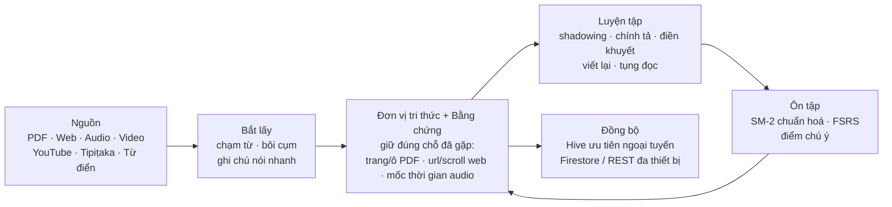
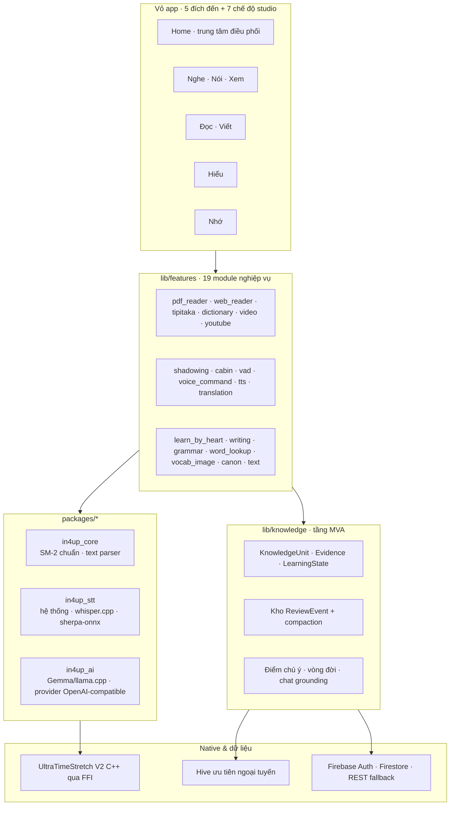

<div align="center">


# In4Up

### Nghe · Nói · Xem · Đọc · Viết · Hiểu · Nhớ

**Xưởng học tập ưu tiên ngoại tuyến dành cho người nghe sâu và học ngôn ngữ**, dựng trên engine âm thanh
native **UltraTimeStretch V2** — tốc độ **0.05× đến 10×** mà giọng nói vẫn tự nhiên.

[](https://github.com/Pabhassaracitto/In4Up/releases)
[](pubspec.yaml)
[](https://flutter.dev)
[](#hỗ-trợ-nền-tảng)
[](#bức-tranh-tiến-độ)
[](https://github.com/Pabhassaracitto/In4Up/actions/workflows/app_analyze.yml)
[](LICENSE)

[🇬🇧 English](README.md) · **Tiếng Việt**

</div>

---

## 30 giây để hiểu In4Up

Học sâu thường bị cắt vụn bởi công cụ: một app để chậm audio, một app đọc PDF, một app dịch, một app
flashcard. Mỗi lần chuyển tay là một lần mất chú ý — mà chú ý mới là tài nguyên khan hiếm nhất.

**In4Up gom trọn vòng học vào một chỗ, trên một máy, phần lớn chạy ngoại tuyến:**

| | |
|---|---|
| 🎧 **Nghe rõ từng âm tiết** | DSP C++ native, 0.05×–10×, bảo toàn formant — bài Pháp thoại hay bài giảng tiếng Anh ở 0.3× vẫn nghe ra chữ. |
| 📖 **Giải mã điều vừa nghe** | Tab Đọc có lớp IPA, tô màu CEFR + loại từ, dịch đa engine, trình đọc PDF / Web / Tipiṭaka. |
| 🎙️ **Tự mình tạo ra lại** | Shadowing chấm điểm theo âm vị, cabin STT trực tiếp, chép chính tả, điền khuyết, viết lại ý và tóm tắt. |
| 🌱 **Giữ lại được** | Một hàm SM-2 duy nhất + FSRS cho học thuộc lòng, Vườn Trí Nhớ, điểm chú ý, đồng bộ đa thiết bị. |
| 🔒 **Riêng tư** | Whisper, Sherpa-ONNX, Piper, llama.cpp chạy **ngay trên máy**; AI đám mây là tùy chọn, tự nhập key, app không kèm key nào. |

---

## Mục lục

- [Bức tranh tiến độ](#bức-tranh-tiến-độ)
- [Phòng Studio: bảy chế độ](#phòng-studio-bảy-chế-độ)
- [Vòng học](#vòng-học)
- [Những gì vừa hoàn thành](#những-gì-vừa-hoàn-thành)
- [Danh mục tính năng](#danh-mục-tính-năng)
- [AI trên máy & trung tâm model](#ai-trên-máy--trung-tâm-model)
- [Kiến trúc](#kiến-trúc)
- [Hệ thiết kế](#hệ-thiết-kế)
- [Bắt đầu](#bắt-đầu)
- [Hỗ trợ nền tảng](#hỗ-trợ-nền-tảng)
- [Cổng chất lượng](#cổng-chất-lượng)
- [Lộ trình](#lộ-trình)
- [Cách dự án được vận hành](#cách-dự-án-được-vận-hành)
- [Giấy phép & ghi công](#giấy-phép--ghi-công)

---

## Bức tranh tiến độ

> Nguồn sự thật duy nhất về trạng thái công việc là [`docs/project/KANBAN.md`](docs/project/KANBAN.md).
> Các con số dưới đây là ảnh chụp bảng đó ngày **28-09-2026**.

| Chỉ dấu | Giá trị |
|---|---|
| Thẻ việc trên bảng | **88** — ✅ 60 xong · 🔄 19 đang làm · 📋 6 đề xuất · 🚫 3 nghẽn |
| Milestone bàn giao | **M0 · M1 · M2 đã done** (schema tri thức → pipeline ghi nhớ → trí tuệ gợi ý); M3 cố ý để ngoài phạm vi |
| Quyết định kiến trúc | **ADR-0001 → ADR-0008** trong [`docs/adr/`](docs/adr) |
| Kế hoạch đã tiếp nhận | **32** mục trong [`docs/project/PLAN.md`](docs/project/PLAN.md) |
| Quy mô mã nguồn | ~**600** file Dart · ~**255k** dòng trong `lib/` + `packages/` |
| Kiểm thử tự động | **81** file test (knowledge, PDF reader, IPA, dịch, Thuộc lòng, cabin, cổng locale…) |
| Ngôn ngữ giao diện | **26** bộ ARB · **492** key mỗi bộ |
| Oracle CI | `app_analyze.yml` (analyze + rule #5 locale + LHB + cabin), `build.yml`, `build_final_complete.yml` |
| Đang nghẽn | Đóng gói zip Windows và job CI Linux (`webkit2gtk-4.1`) — chờ thao tác của chủ repo |

**Quy ước ký hiệu trong tài liệu này:** ✅ đã xong, CI xanh · 🔄 đang làm · 📋 đã lên kế hoạch · 🚫 nghẽn.
"Đã xong" nghĩa là code đã nằm trên nhánh phát triển và CI xanh; một số mục còn chờ **nghiệm thu trên máy
thật** — thẻ Kanban của từng mục ghi rõ điều đó.

---

## Phòng Studio: bảy chế độ

Thanh dưới chỉ giữ **năm đích đến** để điều hướng nằm gọn trong trí nhớ làm việc
(Home · Nghe · Đọc · Hiểu · Nhớ). Trong Nghe và Đọc có công tắc mode phụ, còn Home phơi bày cả bảy chế độ
dưới dạng lưới **Phòng Studio**.

| Chế độ | Ở đâu | Bạn thực sự làm gì |
|---|---|---|
| 🎧 **NGHE** | Tab Nghe | Sóng âm cuộn với playhead cố định, lặp A–B kèm khoảng lặng tùy chỉnh, rèm LRC/phụ đề, Âm mục, tốc độ 0.05×–10×. |
| 🎙️ **NÓI** | Nghe ▸ mode phụ | Trung tâm shadowing: ghi âm, canh dòng, chấm phát âm theo âm vị, preset hệ thống + cá nhân, lịch sử nói kèm xuất nhận xét. |
| 📺 **XEM** | Nghe ▸ mode phụ | Thư viện và trình phát video local kèm phụ đề, bắt từ ngay khi đang xem. |
| 📖 **ĐỌC** | Tab Đọc | Trình đọc tương tác: lớp IPA, tô màu CEFR + loại từ, chạm để lưu từ kèm ngữ cảnh, lưu hàng loạt, nối PDF / Web / Tipiṭaka / từ điển. |
| ✍️ **VIẾT** | Đọc ▸ mode phụ | Write Studio: chép, điền từ, chọn đáp án, "viết lại ý", "tóm tắt ngắn" — chấm cục bộ trước, AI local là tầng hai tùy chọn. |
| 💡 **HIỂU** | Tab Hiểu | Đồng bộ audio ↔ văn bản, phát song ngữ, kiểm tra mức hiểu, dịch xuyên tab. |
| 🌱 **NHỚ** | Tab Nhớ | Vườn Trí Nhớ (Hạt → Mầm → Cây → Cành → Nụ → Hoa), hàng đợi SM-2, word list, timeline, thống kê, bản đồ tri thức, Thuộc lòng. |

Tools **không** còn là tab thứ sáu. Chúng nằm trong lớp phủ **hành động nhanh** (⚡) sắp xếp theo ngữ cảnh
tab hiện tại và tần suất dùng gần đây — Cabin, YouTube, PDF, Web Reader, YouGlish, Âm mục, Từ điển,
Thư viện video, Word list, Ôn tập, Thống kê, Bản đồ từ, Tipiṭaka…

---

## Vòng học



Hai nguyên tắc sản phẩm bảo vệ vòng học này và được soi trong code review:

1. **Mở lại nguồn không bao giờ được hỏng.** Evidence lưu toạ độ để nhảy về đúng ô chữ trên trang PDF,
   đúng vị trí cuộn, đúng mốc thời gian (ADR-0003).
2. **Đang đọc thì không bị dialog chặn.** Vòng đời Dual-Memory
   (Observed → Captured → Promoted → Practicing → Maintained) thăng cấp thẻ ở nền; đọc năm phút phải
   không gặp một popup chặn luồng nào.

---

## Những gì vừa hoàn thành

Điểm nhấn của chu kỳ phát triển hiện tại. Mỗi dòng đều tra được bằng mã thẻ trong
[`docs/project/KANBAN.md`](docs/project/KANBAN.md).

<details open>
<summary><b>🔊 Âm thanh, giọng nói & ngăn xếp speech ngoại tuyến</b></summary>

- ✅ **Âm mục (Soundlist)** — biến mọi bản ghi thành "sách nói tra được": điểm đánh dấu, mục lục kiểu sách,
  đoạn A–B đã lưu, **auto-TOC** (Silero VAD cắt theo khoảng lặng, Whisper đặt tên từng chương),
  transcript tìm kiếm được, và gợi ý thông minh "chỗ này bạn lặp 3 lần trong 14 ngày".
- ✅ **Ngăn xếp Sherpa-ONNX** — Silero VAD thay fallback theo năng lượng (`SHERPA-001`), **Piper TTS neural**
  ngoại tuyến (`SHERPA-002`), pipeline cắt chunk cho file 30 phút (`SHERPA-003`), sóng âm theo người nói +
  **lệnh giọng nói** (`SHERPA-WP23-01`), và **Zipformer live STT** — tiếng Việt offline + tiếng Anh streaming
  (`SHERPA-WP4-01`).
- ✅ **Whisper vững hơn** — tuần tự hoá request native + pre-flight đã dứt điểm crash SIGSEGV `libwhisper.so`
  (`STT-CRASH-001`); tạo lời (LRC) hỗ trợ 14 ngôn ngữ kèm `auto` nhận diện (`STT-LRC-LANG-01`).
- ✅ **Cabin dịch trực tiếp** — phiên mic tự hồi phục, bỏ giới hạn 2 phút, có chế độ đọc chính tả; và
  🔨 **Cabin Save**: lưu WAV + LRC song ngữ thành phiên, mở lại được trong tab Đọc.
- ✅ **Thư viện audio** — quét MediaStore/SAF trên Android, sửa phát `content://`, import audio bền vững.

</details>

<details open>
<summary><b>📖 Đọc, IPA & trí tuệ văn bản</b></summary>

- ✅ **Bộ IPA (READ-IPA-001 → 004)** — toggle 3 trạng thái với dòng phiên âm dưới chữ, nguồn IPA theo thác
  nước **MDX → CMUdict → G2P** kèm provenance, word-chip kiểu ruby nháy theo nhịp TTS, và tô màu phoneme
  dẫn xuất từ bảng màu **Okabe-Ito** an toàn cho người mù màu, từ đã thuộc thì làm mờ.
- 🔄 **READ-IPA-006** — panel màu IPA tương tác (ẩn từng loại), màu **nối âm** và đánh dấu **từ nhấn**;
  code xong, chờ CI + nghiệm thu máy.
- ✅ **Lưu điều đang đọc cho ra hồn** — lưu cụm/câu nhiều dòng kèm chủ đề + ngôn ngữ, sheet sửa không làm
  mất trường dữ liệu, marker "từ đã lưu" bật/tắt kèm chú giải, và lưu hàng loạt dùng chung cho PDF lẫn Web.
- 🔨 **PDF Reader wave 0–2** — nối selection, TTS theo câu, định danh file ổn định (`md5(size|mtime)`),
  hệ toạ độ có tài liệu (ADR-0003/0004), mục lục, tìm trong file, thumbnail, nhảy trang, phím tắt,
  chủ đề đọc, xuất/nhập chú thích (JSON / XFDF / PDF đóng dấu). Đã viết 134 test.
- 🔄 **Từ điển MDX/MDD** (`DICT-001`) — nhập, tra và quản lý từ điển đa ngữ ngay trên máy.
- ✅ **Module Tipiṭaka** — SQLite chuẩn hoá, đọc song ngữ, tìm kiếm, 26 gói ngôn ngữ và script nhập liệu;
  xem [`docs/tipitaka_database.md`](docs/tipitaka_database.md).
- 📋 **READ-GRAM-001** — phân tích cụm từ và cấu trúc câu ngay chỗ "loại từ / CEFR". Spike đo **trung thực**
  17/25 case đóng băng (68 %); kế hoạch và bốn nguyên nhân gốc nằm ở PLAN-031 + ADR-0007, chưa viết code.

</details>

<details open>
<summary><b>🧠 Tri thức, trí nhớ & AI</b></summary>

- ✅ **Tầng tri thức MVA** (`lib/knowledge/`, MVA-T1 → T8) — KnowledgeUnit · Evidence · LearningState ·
  ReviewEvent · LearningAction, merge/split hoàn tác được, sổ ôn tập append-only kèm compaction,
  vòng đời Dual-Memory, **Attention Score v1**, và **chat grounding có validator trích dẫn**.
- ✅ **Một hàm SM-2 duy nhất** (ADR-0001) — bản chết thứ tư đã bị xoá, lưới tương đương 384 tổ hợp canh
  ngữ nghĩa. Ba kỹ năng Nghe / Đọc / Hiểu vẫn giữ điểm **riêng biệt** một cách có chủ đích.
- ✅ **Thuộc lòng (Learn by Heart)** — FSRS cold-start, cloze tan dần 4 tầng, mnemonic chữ cái đầu,
  **voice recall** khớp mờ, nối xích câu kệ, cloze `{{c1::}}` kiểu Anki, và đồng bộ đa thiết bị có bia mộ
  + hàng đợi pending (ADR-0006, 47 test chạy trong CI).
- ✅ **AI chat local thật** — backend llama.cpp / Gemma GGUF với hàng đợi FIFO, ngân sách context có giới hạn,
  timeout hữu hạn, isolate tự hồi phục và banner trạng thái 8 nhánh. CI dựng backend native trên cả
  Android, iOS và Windows.
- ✅ **Tầng Server API WP0** (`API-001`, ADR-0008) — một client OpenAI-compatible cho **Ollama, LM Studio,
  llama-server, Groq, Gemini-compat, OpenRouter, OpenAI**; thêm/sửa provider kèm test kết nối và danh sách
  model động; định tuyến theo từng năng lực (`offlineFirst` mặc định · `onlineFirst` · `offlineOnly`);
  **BYOK** — app không kèm key, và khi chưa cấu hình gì thì **không một request nào rời khỏi máy**.
- ✅ **Dịch thuật** — glossary Phật học/Pāli với token được bảo vệ trước mọi engine, cặp ML Kit ngoại tuyến
  (EN↔VI, EN↔HI, HI↔VI pivot qua EN), cộng chế độ mặc định thông minh online-first tự lùi về offline khi
  mất mạng. Engine: Google (free) · DeepLX · Libre · MyMemory · ML Kit · Hy-MT · offline.

</details>

<details open>
<summary><b>🏠 Vỏ ứng dụng, Home & nền tảng</b></summary>

- ✅ **Home thành trung tâm điều phối** — Phòng Studio đủ bảy chế độ, streak tính từ **sự kiện học thật**
  (`HOME-STREAK-001`), preview Knowledge Graph, và **nạp tri thức nhanh**: một luồng mic duy nhất ưu tiên
  Sherpa offline rồi mới fallback recognizer hệ thống, ghi thẳng vào word list.
- ✅ **Tái cấu trúc điều hướng** — năm đích đến, lớp phủ hành động nhanh thay tab Tools, mode switch
  compact/auto-hide, giữ tab để đổi mode phụ, nhớ mode cuối của từng tab.
- ✅ **Hệ responsive** — kẹp text scale toàn app, `ResponsiveContentFrame`, số cột lưới thích ứng và chiều
  cao card cố định để cỡ chữ trợ năng không làm vỡ layout.
- ✅ **Quản trị đa ngữ** (ADR-0002) — lộ trình bậc vi → en → {hi, zh, zh_TW, si} → còn lại, kèm ratchet CI:
  độ phủ chỉ được tăng, và một test máy sẽ làm đỏ build nếu locale khác `vi` còn sót chrome tiếng Việt.
- ✅ **Đăng nhập trên Linux** (ADR-0005) — Google sign-in và đồng bộ từ vựng qua Firebase REST ở nơi không có
  plugin FlutterFire native, không thêm dependency nào.
- 🔄 **Học qua YouTube** theo tinh thần Language Reactor, local-first, không cần server yt-dlp.

</details>

---

## Danh mục tính năng

<details>
<summary><b>Engine âm thanh — UltraTimeStretch V2</b></summary>

- DSP C++ native gọi qua Dart FFI (`lib/ffi/`, mã nguồn trong `native/`).
- Tốc độ **0.05× – 10×**, dịch cao độ theo nửa cung, bảo toàn formant bằng phân tích cepstral nên giọng
  không bị hoá "chipmunk".
- Phase vocoder đa phân giải + tách harmonic/percussive để giảm artefact ở tốc độ cực chậm.
- Tối ưu SIMD (NEON / AVX) cho độ trễ thấp trên di động và desktop.
- ⚠️ **Vùng bảo vệ.** Quy tắc vàng #1: không sửa `lib/ffi/` và lõi C++ UltraTimeStretch nếu chủ dự án chưa
  đồng ý — lỗi audio realtime rất đắt và CI gần như không bắt được.

</details>

<details>
<summary><b>Nguồn nội dung</b></summary>

| Nguồn | Khả năng |
|---|---|
| Audio trên máy | Quét MediaStore / SAF, import bền vững, cache waveform, định danh bằng fingerprint |
| Video trên máy | Thư viện + trình phát kèm phụ đề, bắt từ khi đang xem |
| PDF | Render + trích text (pdfrx/PDFium), chú thích, mục lục, tìm kiếm, xuất |
| Web | Trình đọc trong app, chọn vùng trích xuất, lưu hàng loạt, sheet chạm từ |
| YouTube | Tìm kiếm, tải audio, lấy caption đa ngữ → biến thành tài liệu học |
| Google Drive | Duyệt và stream audio cá nhân |
| Tipiṭaka | Kinh điển SQLite chuẩn hoá, đọc song ngữ, tìm kiếm, gói ngôn ngữ tải thêm |
| Từ điển | Nhập MDX/MDD, tra ngoại tuyến, làm nguồn IPA khi lưu từ |
| Tệp văn bản | `.txt`, `.md`, `.json`, `.docx`, LRC/SRT — loader thuần Dart, không thêm dependency |

</details>

<details>
<summary><b>Tiếng vào và tiếng ra</b></summary>

- **STT (`packages/in4up_stt`)** — facade lai giữa recognizer hệ thống, **whisper.cpp** (FFI trên Windows,
  plugin trên di động) và **sherpa-onnx Zipformer** (tiếng Việt offline, tiếng Anh streaming), kèm trình
  quản lý model, chuyển đổi audio (FFmpegKit trên mobile, tiến trình `ffmpeg` trên desktop), chuyển LRC và
  sidecar phân biệt người nói.
- **TTS** — Google, FPT, Zalo, engine hệ điều hành, và **giọng neural Piper** ngoại tuyến, có cache, nhận
  diện ngôn ngữ, tuỳ chọn theo từng giọng và catalog tải giọng từ `rhasspy/piper-voices`.
- **Phát âm** — CMUdict + G2P theo luật, bộ phân tích âm vị, so sánh sóng âm, thẻ điểm chi tiết.

</details>

<details>
<summary><b>Đồng bộ, lưu trữ & riêng tư</b></summary>

- **Hive** ưu tiên ngoại tuyến cho mọi thứ người học tạo ra; mạng chỉ là phần thêm, không phải cửa ải.
- **Firebase Auth** (Google / ẩn danh) + **Cloud Firestore** cho từ vựng, bài Thuộc lòng, trạng thái SRS và
  streak; hàng đợi thao tác chờ sống sót qua lúc mất mạng, hợp nhất theo last-writer-wins kèm bia mộ.
- **Firestore REST** thay thế ở nền tảng không có plugin native (Linux).
- AI đám mây hoàn toàn tùy chọn và BYOK; HTTP không mã hoá chỉ được phép với địa chỉ LAN.

</details>

---

## AI trên máy & trung tâm model

Không có model nặng nào được nhét vào file cài. Vào **Home ▸ Quản lý Model AI** để **Import** file bạn đã có
hoặc **Tải về** khi bạn bấm — app không bao giờ tự tải. Hướng dẫn thao tác cho model, API, từ điển,
Tipiṭaka, media và PDF/OCR: [`Tiếng Việt`](docs/USER_GUIDE.vi.md) · [`English`](docs/USER_GUIDE.md). Layout model dành cho developer:
[`docs/project/MODELS.md`](docs/project/MODELS.md).

| Model | Thư mục trong `documents/` | Dung lượng | Dùng cho | Bắt buộc? |
|---|---|---|---|---|
| **Whisper** (ggml) | `in4up_whisper_models/` | 37–75 MB | bóc băng, tạo LRC, đặt tên chương auto-TOC | khi dùng STT |
| **Silero VAD** (onnx) | `sherpa_vad_models/` | 2–5 MB | cắt khoảng lặng, xử lý file dài nhanh | khuyến nghị |
| **Piper TTS** | `sherpa_piper_models/` | ~75 MB / giọng | đọc chữ neural ngoại tuyến | khi cần TTS offline |
| **Zipformer ASR** | `sherpa_asr_models/` | 20–32 MB | nhận diện giọng nói trực tiếp offline | khi dùng Cabin |
| **Gemma / llama.cpp GGUF** | trung tâm model | 0.6–2 GB | chat, phân tích, nhận xét bài viết tại chỗ | tùy chọn |
| **Hy-MT GGUF** | trung tâm model | ~600 MB | dịch máy ngoại tuyến | tùy chọn |

> **Tầng Server API** sinh ra chính vì model nặng ngốn RAM, sinh nhiệt và mất thời gian nạp trên điện thoại:
> trỏ In4Up sang Ollama / LM Studio chạy trên PC cùng mạng LAN, hoặc sang endpoint đám mây bằng key của bạn,
> mà vẫn giữ đường ngoại tuyến làm mặc định.

---

## Kiến trúc



### Bản đồ kho mã

| Đường dẫn | Chứa gì |
|---|---|
| `lib/screens/` | Vỏ app, năm tab, các chế độ Studio, tools, cài đặt (142 file) |
| `lib/features/` | 19 module nghiệp vụ độc lập (221 file) |
| `lib/knowledge/` | Model tri thức MVA, kho ôn tập, điểm chú ý, grounding (18 file) |
| `lib/services/` | Lưu trữ, đồng bộ, giải IPA, thư viện audio, auto-TOC, loader văn bản (28 file) |
| `lib/providers/` | Trạng thái player, text, từ vựng, waveform, focus (15 file) |
| `lib/core/` | Danh mục 26 ngôn ngữ và hệ responsive |
| `lib/l10n/` | 26 bộ ARB × 492 key + bản localizations sinh ra |
| `lib/ffi/`, `lib/native/`, `native/` | Binding và mã C++ UltraTimeStretch (**vùng bảo vệ**) |
| `packages/` | `in4up_core`, `in4up_stt`, `in4up_ai` |
| `android/ ios/ windows/ linux/ web/` | Vỏ nền tảng, CMake native, flavors |
| `assets/` | Icon, CMUdict, glossary, DB Tipiṭaka mẫu, thư mục thả model |
| `brand/` | Phác thảo logo, mark đã chọn, token màu |
| `docs/` | Governance, Kanban, kế hoạch, ADR, skill agent, bàn giao |
| `test/`, `tool/`, `scripts/` | 81 file test, công cụ i18n, script CI, importer |

---

## Hệ thiết kế

Giao diện dành cho những buổi học dài trong ánh sáng yếu: nền tối, một tông ấm cho ý nghĩa, một tông mát cho
sự tăng trưởng, và màu luôn mang **thông tin** chứ không phải trang trí.

### Token thương hiệu

| Mẫu | Token | Mã màu | Vai trò & dụng ý |
|---|---|---|---|
|  | Midnight | `#06121E` | Nền chính. Độ sáng thấp giảm mỏi mắt và giữ sóng âm là vật sáng nhất trên màn hình. |
|  | Deep knowledge | `#091A2A` | Card và sheet — chỉ một bậc nâng, để chiều sâu được *cảm nhận* chứ không bị phô. |
|  | Bodhi gold | `#F4C95D` | Tuệ giác, ánh sáng, nét đi lên của logo. Chỉ dành cho hành động quan trọng nhất của mỗi màn. |
|  | Growth jade | `#53D6BD` | Tiến bộ, streak, thành công. Đi cùng vàng cho cảm giác "tăng trưởng an tĩnh", không phải "ăn thua". |
|  | Warm ivory | `#F8F4EA` | Chữ nội dung. Dịu hơn trắng thuần, giảm hiện tượng loé chữ trên nền tối khi đọc lâu. |

### Màu của từng chế độ

Mỗi chế độ giữ một tông riêng, và tông đó đi theo bạn vào app bar, chip mode và card — nên bạn biết mình
đang ở đâu mà không cần đọc chữ.

|  Nghe `#6C63FF` |  Nói `#B388FF` |  Xem `#FFB300` |  Đọc `#2196F3` |
|---|---|---|---|
|  **Viết** `#26C6DA` |  **Hiểu** `#FFB300` |  **Nhớ** `#4CAF50` | |

Màu phoneme trong tab Đọc dùng bảng **Okabe-Ito** an toàn cho người mù màu, và mọi tín hiệu màu đều có bạn
đồng hành phi màu sắc (icon, nhãn hoặc chú giải) để không ai mất thông tin vì khiếm khuyết thị giác màu.

### Nguyên tắc bố cục

- **Tối đa năm đích đến** ở thanh dưới; mode phụ được *hé lộ*, không chồng chất.
- Breakpoint `compact · medium · expanded · large`, `ResponsiveContentFrame` giới hạn bề ngang trên desktop,
  `adaptiveGridColumns` chọn 1–5 cột cho lưới Studio.
- Chiều cao card cố định bằng `mainAxisExtent` thay vì tỉ lệ, nên cỡ chữ hệ thống lớn không gây
  `RenderFlex overflow`.
- Text scale hệ thống được kẹp toàn app trong `MaterialApp.builder`.
- Vùng chạm tối thiểu 44 × 32 dp; menu ngữ cảnh neo vào chip, không neo vào cả danh sách.
- Header và banner tự ẩn sau vài giây; mode switch có thể compact, tự ẩn, hoặc thay bằng giữ tab.
- Kịch bản QA tay được ghi sẵn trong [`docs/shell_manual_qa_checklist.md`](docs/shell_manual_qa_checklist.md).

---

## Bắt đầu

### Yêu cầu

- **Flutter 3.44.1** (đúng bản ghim trong CI), Dart SDK `>=3.0.0 <4.0.0`
- Android: JDK 17, Android SDK 35, NDK `28.2.13676358`, bộ CMake
- iOS: Xcode với deployment target **15.5+**
- Windows: bộ biên dịch C++ của Visual Studio + CMake (cần cho engine native)
- Tùy chọn: một project Firebase — không có thì app vẫn chạy, chỉ là không đồng bộ

### Tải về & chạy

```bash
git clone https://github.com/Pabhassaracitto/In4Up.git
cd In4Up
flutter pub get

# Android — flavor: stable | dev | beta  (com.in4up[.dev|.beta])
flutter run --flavor stable

# Desktop
flutter run -d windows
flutter run -d linux

# iOS
flutter run -d ios
```

### Firebase (tùy chọn nhưng nên có)

| Nền tảng | Tệp | Đặt ở |
|---|---|---|
| Android | `google-services.json` | `android/app/` — một tệp dùng chung cho cả ba flavor |
| iOS / macOS | `GoogleService-Info.plist` | `ios/Runner/` |
| Khác | options sinh sẵn | `lib/firebase_options*.dart` theo môi trường |

### Kiểm tra trước khi push

```bash
# Đúng oracle mà CI dùng — chỉ ERROR mới là lỗi
flutter analyze --no-pub --no-fatal-infos --no-fatal-warnings

# Quy tắc vàng #5: locale ≠ vi thì chrome không được còn tiếng Việt
flutter test test/locale_chrome_no_vietnamese_test.dart

# Các bộ trọng điểm
flutter test test/knowledge/ test/pdf_reader/ test/cabin/
flutter test                      # chạy tất cả
```

---

## Hỗ trợ nền tảng

| Nền tảng | Trạng thái | Ghi chú |
|---|---|---|
| **Android** | ✅ chính | minSdk 24 · target 35 · flavor `stable`/`dev`/`beta` · native UltraTimeStretch, whisper.cpp, llama.cpp, sherpa-onnx |
| **Windows** | ✅ hỗ trợ | Thư viện native dựng bằng CMake, `just_audio_windows`, `webview_windows`, Whisper qua FFI/CLI · 🚫 còn nghẽn khâu đóng gói zip release (`CI-WINDOWS-01`) |
| **iOS** | ✅ CI build xanh | Deployment target 15.5, ATS cho phép mạng nội bộ để nối server AI LAN |
| **Linux** | 🔄 một phần | Đăng nhập Google và đồng bộ chạy qua Firebase REST (ADR-0005) · 🚫 job CI nghẽn vì `webkit2gtk-4.1` |
| **Web** | 🔄 hạn chế | Giao diện chạy được; các engine FFI native (time-stretch, Whisper, llama.cpp, sherpa) không có trên web |

Bản build do GitHub Actions tạo và phát hành ở [Releases](https://github.com/Pabhassaracitto/In4Up/releases);
In4Up không phát hành qua các chợ ứng dụng.

---

## Cổng chất lượng

| Cổng | Bảo vệ điều gì |
|---|---|
| `app_analyze.yml` | Analyze toàn app (chỉ ERROR mới đỏ) + test rule #5 locale + bộ Thuộc lòng + bộ Cabin; log tải lên artifact |
| `build.yml` | Build release Android, iOS, Windows — kèm pipeline native llama.cpp/whisper |
| `build_final_complete.yml` | Ma trận mở rộng, có cả job Linux |
| Bộ Knowledge | `test/knowledge/` — schema, merge/split, lưới tương đương SM-2, compaction, vòng đời, grounding |
| Bộ PDF | `test/pdf_reader/` — hình học, định danh file, mục lục, tìm kiếm, phím tắt, độ phủ i18n |
| Ratchet i18n | Sàn theo bậc ADR-0002 trong `tool/lang_rollout_report.py`; độ phủ chỉ được tăng |
| Skill cho agent | [`docs/skills/ci-red-debugging/SKILL.md`](docs/skills/ci-red-debugging/SKILL.md) — chẩn đoán CI đỏ khi không đọc được log |

---

## Lộ trình

**Đang làm**

- Nghiệm thu thiết bị cho PDF Reader wave 0–2 và các định dạng xuất còn lại.
- `READ-IPA-006`: panel IPA tương tác, màu nối âm, đánh dấu từ nhấn.
- Hoàn thiện Từ điển MDX (`DICT-001`) và video local (`VID-001`).
- Cabin Save đi trọn vòng sang tab Đọc; nén audio.
- Server API WP1–WP4: cắm engine chat / STT / TTS từ xa vào công tắc định tuyến.

**Kế tiếp (kế hoạch đã nhận)**

- `READ-GRAM-001` / PLAN-031 — cụm từ và cấu trúc câu bên cạnh loại từ và CEFR.
- `INTEGRATE-1` — gộp nốt phần lịch sử nhánh knowledge-work vào trunk.
- `I18N-001` — dọn tồn đọng chuỗi UI chưa phân loại và nâng độ phủ locale bậc T3.
- PLAN-026 ảnh minh hoạ từ vựng, PLAN-027 VieNeu-TTS, PLAN-006 kiểm tra chéo đa chiều.

**Cố ý để ngoài phạm vi** (mở lại phải có ADR mới): embedding, vector DB, pipeline tóm tắt LLM tự động,
fine-tune GGUF và giao diện knowledge graph đầy đủ.

---

## Cách dự án được vận hành

Kho mã này được làm bởi **chủ dự án và các AI agent**, nên quy trình phải viết ra giấy chứ không nằm trong
trí nhớ. Hãy đọc trước khi sửa bất cứ thứ gì:

| Tài liệu | Vai trò |
|---|---|
| [`AGENTS.md`](AGENTS.md) | Cửa vào cho mọi agent: skill cần tải, tài liệu kiến trúc, quy tắc vàng, kinh nghiệm CI |
| [`docs/GOVERNANCE.md`](docs/GOVERNANCE.md) | Hiến pháp: ghi trạng thái thế nào, nối lịch sử ra sao, ai được huỷ việc |
| [`docs/project/KANBAN.md`](docs/project/KANBAN.md) | Nguồn sự thật duy nhất về trạng thái — chỉ đổi trạng thái, chỉ nối lịch sử, không xoá |
| [`docs/project/PLAN.md`](docs/project/PLAN.md) | Milestone, acceptance test, và nơi tiếp nhận kế hoạch mới từ chủ dự án |
| [`docs/adr/`](docs/adr) | Architecture Decision Record — mọi quyết định cấu trúc, kèm postmortem |
| [`docs/skills/`](docs/skills) | Skill dùng lại cho agent, bắt đầu từ chẩn đoán CI đỏ |
| [`docs/Bangiao/`](docs/Bangiao) | Bản bàn giao theo từng hệ con (Sherpa, từ điển, Tipiṭaka, video, ảnh) |
| [`docs/USER_GUIDE.vi.md`](docs/USER_GUIDE.vi.md) | Hướng dẫn người dùng: model offline, Server/API, MDX, Tipiṭaka, media, PDF/OCR/TTS/IPA |
| [`docs/manual_qa_I4U18_DOCS_001.md`](docs/manual_qa_I4U18_DOCS_001.md) | Checklist owner nghiệm thu các luồng trên thiết bị |

### Quy tắc vàng

1. **Không đụng** `lib/ffi/` và lõi C++ UltraTimeStretch — audio realtime là vùng bảo vệ.
2. **Không gộp** ba điểm kỹ năng SM-2 (Hiểu / Nghe / Đọc) thành một con số — tách là có chủ đích.
3. **Không làm mất khả năng mở lại nguồn** đúng vị trí (trang + ô PDF, url + scroll web, mốc thời gian audio).
4. **Đổi kiến trúc thì phải có ADR** và code review — không "hội đồng AI".
5. **Locale ≠ tiếng Việt ⇒ chrome không được còn tiếng Việt.** Thiếu bản dịch thì hiện English, không bao
   giờ lùi về `vi`. Nội dung của người dùng — văn bản, lời bài, ghi chú, output AI, transcript — không nằm
   trong phạm vi quy tắc này.

### Đóng góp

Hoan nghênh đóng góp cho mục đích cá nhân, giáo dục và phi thương mại. Với thay đổi lớn, hãy mở issue để
bàn trước, giữ commit nhỏ, và cập nhật thẻ Kanban ngay trong cùng pull request với phần code tương ứng.

---

## Giấy phép & ghi công

Phát hành theo **Source-Available License (Non-Commercial)** — xem [`LICENSE`](LICENSE).
Bạn được dùng, sao chép và sửa mã nguồn cho mục đích cá nhân, giáo dục và nghiên cứu phi thương mại.
Dùng vào mục đích thương mại cần văn bản đồng ý trước của tác giả.

Đứng trên vai những người khổng lồ: [whisper.cpp](https://github.com/ggerganov/whisper.cpp) ·
[sherpa-onnx (k2-fsa)](https://github.com/k2-fsa/sherpa-onnx) · [Piper voices](https://github.com/rhasspy/piper-voices) ·
[llama.cpp](https://github.com/ggerganov/llama.cpp) · [pdfrx / PDFium](https://github.com/espresso3389/pdfrx) ·
[CMUdict](http://www.speech.cs.cmu.edu/cgi-bin/cmudict) · bảng màu trợ năng Okabe-Ito ·
dữ liệu kinh điển OpenTipitaka / Pa-Auk · và hệ sinh thái Flutter.

> Xin tôn trọng bản quyền khi nhập nội dung bên ngoài như audio YouTube hay sách đã xuất bản.

<div align="center">

**In4Up** — *đi vào bên trong, để hướng lên trên.*

</div>
